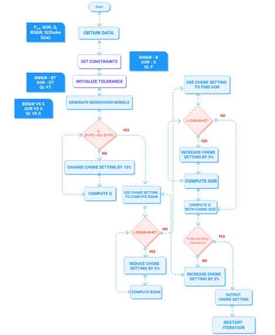
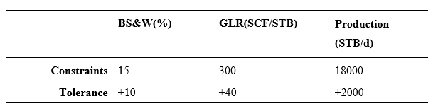
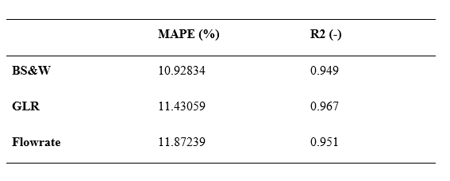

<div align="center">

# **Dynamic-Statistical-Modelling-of-Production-Systems**


</div>

<div align="justify">

 Here, a dynamic statistical modelling approach is developed which uses real time most recent data to continously create best fit statistical models to be used to obtain optimal values applied to decision making. The methods applied here entail an end to end analysis from the point of obtaining data, to storage, and statistical modelling. However, The statistical modelling is the only aspect explained in this readme. This method is used in this project in petroleum production systems.

 The presentation of this project is a confidential document. You can however reach me to get information about the project.
 
 Use this readme file to understand the project and the results obtained. If you would like to collaborate on a data-based related project, you can contact me on israelbssy@gmail.com.
 
**Please note that Microsoft 365 is essential to have if you would want to use the workbook in this project.**

</div>


<div align="center">


[](https://github.com/ellerbrock/open-source-badges/)

For the Badges [source](https://shields.io/)


</div>

## **Author**

- [Israel Bassey](https://github.com/BasseyIsrael)


## **Table of Contents**

  - [Introduction & Project Problem](#introduction--project-problem)
  - [Source of Data](#source-of-data)
  - [Methods Applied](#methods-applied)
  - [Quick Glance at Key Results](#quick-glance-at-key-results)
  - [Limitation and Improvement Opportunities](#limitations-and-improvement-opportunities)
  - [Explore User Interface](#explore-workbook)
  - [Contribution](#contribution)

<div align="Justify">


# **Introduction & Project Problem**

Most production systems depend heavily on process optimization and the efficiency of its operations to obtain maximum value from its hydrocarbon assets at any time during production.
this usually involves close monitoring of the choke which controls the flow of fluids from the producing well. Operators are constantly in search of, and implementing innovative methodologies that would help obtain the most optimal hydrocarbon production from a well given a set of conditions. 

The overall project focuses on the development of a monitoring system which reads the production data, communicates it through a transmitting channel, passes it on to an engine that generates a statistical model that mimics the most recent behaviour of the fluid in the flow system, uses the models to give the best flow conditions that will yield the needed flow rate, and makes the needed adjustment to ensure optimized production through the production choke.


# **Source of Data**

The data utilized in this project is mostly data obtained from tests performed in field cases.  

The data is however not provided is this repository to ensure anonimity, and reduce data exploitation. You can contact me on israelbssy@gmail.com if you have any needs for the data used.


# **Methods Applied**

A simplified display of the workflow employed in this project is presented in the image below. This explains how the full system was designed to operate. 


The data being utilized here, are dependent on the type of model being applied in the software system. It should be taken worthy of note that the relevance seriously lies on the use alongside an adjustable choke. The parameters considered in this project are:
1.	Pressure
2.	Temperature
3.	Flowrate
4.	BS&W
5.	Gas-Oil Ratio
6.	Choke Setting


Following this, the information flow schematic is shown as well. This elaborates in the first image. 


With particular focus on the software aspect on this project, an algorithmic workflow was developed to determine optimal flow conditions based on conditions set by the operator, using the data flowing as presented in the above image. 

The Algorithmic Workflow:



The predictive methodologies used in this project are based on regression algorithms. 

1.	Linear Regression
2.	Polynomial Regression
3.	Exponential Regression
4.  Power Law Models

For every iteration, new set of models are developed based on the algorithms mentioned, and the best model is used to make immediate predictions that are needed to make the final decision as presented in the flowchart. 

The whole process in implemented in Excel VBA. This choice was based on the ease of applicability considering some restrictions that may come with developing external software.

Explore the workbook [here]()

The fits are created using a block that looks like the code below. The code below is for a linear fit however, it can be simply refactored to cover the other models. 

```bash
Sub LinearFit_Select()
    
    Dim charnum As Integer
    Dim iR2 As Long, iEqual As Long
    Dim linearFitLabel As String
    Dim strR2 As String
    Dim r2 As Double
    
    
    
    ActiveSheet.ChartObjects("FitChart").Activate
    charnum = ActiveChart.FullSeriesCollection(1).Trendlines.Count
    'MsgBox charnum
    If charnum <> 0 Then
        ActiveChart.FullSeriesCollection(1).Trendlines(charnum).Select
        Selection.Delete
    End If
        
    ActiveChart.FullSeriesCollection(1).Trendlines.Add Type:=xlLinear, Forward _
        :=0, Backward:=0, DisplayEquation:=0, DisplayRSquared:=0, Name:= _
        "Linear (Fit Series)"
    
    ActiveSheet.ChartObjects("FitChart").Activate
    ActiveChart.FullSeriesCollection(1).Trendlines(1).Select
    Selection.DisplayEquation = True
    Selection.DisplayRSquared = True
    ActiveChart.FullSeriesCollection(1).Trendlines(1).DataLabel.Select
    Selection.Left = 248.44
    Selection.Top = 4.865

    'ActiveChart.FullSeriesCollection(1).Trendlines(1).Select
    'Get the trendline label; may contain equation in addition to R²
    
    linearFitLabel = ActiveChart.FullSeriesCollection(1).Trendlines(1).DataLabel.Text
    iR2 = InStr(linearFitLabel, "R²") ' find string "R²"
    iEqual = InStr(iR2, linearFitLabel, "=") ' find equal sign after that
    r2 = CDbl(Trim(Mid(linearFitLabel, iEqual + 1))) ' convert everything after = into a number

    'MsgBox "R² displayed on chart: " & r2
    Worksheets("Edit").Range("H14") = r2
    Worksheets("Computation").Range("A1").Select
End Sub
```

To obtain the iterative process, the block of code below is called. This is written according to the algorithmic flowchart presented earlier.

```bash
Sub Calculate_Click()
    Dim choke_val  As Double
    Dim gor As Double
    Dim bsw As Double
    Dim pres As Double
    Dim flow As Double
    
    Dim prod_const As Double
    Dim gor_const As Double
    Dim bsw_const As Double
    
    Dim prod_tol As Double
    Dim gor_tol As Double
    Dim bsw_tol As Double
    
    Check = True: Counter = 0: Total = 0
    
    choke_val = Worksheets("Data").Range("M12").Value
    gor = Worksheets("Data").Range("P12").Value
    pres = Worksheets("Data").Range("N12").Value
    bsw = Worksheets("Data").Range("O12").Value
    flow = Worksheets("Data").Range("Q12").Value
    
    prod_const = CDbl(Worksheets("Computation").TextBoxes("production_const").Text)
    gor_const = CDbl(Worksheets("Computation").TextBoxes("gor_constt").Text)
    bsw_const = CDbl(Worksheets("Computation").TextBoxes("bsw_constt").Text)
    prod_tol = CDbl(Worksheets("Computation").TextBoxes("production_toll").Text)
    gor_tol = CDbl(Worksheets("Computation").TextBoxes("gor_toll").Text)
    bsw_tol = CDbl(Worksheets("Computation").TextBoxes("bsw_toll").Text)
    

    'MsgBox choke_val
    
    
    If flow > prod_const - prod_tol And flow < prod_const + prod_tol Then
        MsgBox "Production Rate is at Optimal Value"
        Worksheets("Computation").Range("N23").Value = flow
    
    ElseIf flow < prod_const - prod_tol Then
        Do While flow < prod_const - prod_tol
            choke_val = choke_val * (1 + 0.01)
            'MsgBox choke_val
            Worksheets("Edit").Range("A28").Value = choke_val
            Worksheets("Computation").Range("J23").Value = choke_val
            flow = Worksheets("Edit").Range("C30")
            Worksheets("Computation").Range("N23").Value = flow
            
            
        Loop
    ElseIf flow > prod_const + prod_tol Then
        Do While flow > prod_const - prod_tol
            choke_val = choke_val * (1 - 0.01)
            Worksheets("Edit").Range("A28").Value = choke_val
            Worksheets("Computation").Range("J23").Value = choke_val
            flow = Worksheets("Edit").Range("C29")
            Worksheets("Computation").Range("N23").Value = flow
        Loop
    End If
    
    'MsgBox bsw
    'MsgBox bsw_const
    'MsgBox bsw_tol
    
    
    If bsw > bsw_const + bsw_tol Then
        Do While bsw > bsw_const + bsw_tol
            Counter = Counter + 1
            If Counter Mod 10 = 0 Then ' Check in with the user on every multiple of 10.
                Check = (MsgBox("Keep going?", vbYesNo) = vbYes) ' Stop when user click's on No
                If Not Check Then Exit Do ' Exit inner loop.
            End If
            choke_val = choke_val * (1 - 0.05)
     '       MsgBox bsw
            Worksheets("Edit").Range("A28").Value = choke_val
            Worksheets("Computation").Range("J23").Value = choke_val
            If Worksheets("Computation").Range("Q22").Value = "Linear" Then
                bsw = Worksheets("Edit").Range("I29").Value
                Worksheets("Computation").Range("L23").Value = bsw
            ElseIf Worksheets("Computation").Range("Q22").Value = "Exponential" Then
                bsw = Worksheets("Edit").Range("I30").Value
                Worksheets("Computation").Range("L23").Value = bsw
            ElseIf Worksheets("Computation").Range("Q22").Value = "Polynomial" Then
                bsw = Worksheets("Edit").Range("I31").Value
                Worksheets("Computation").Range("L23").Value = bsw
            ElseIf Worksheets("Computation").Range("Q22").Value = "Logarithm" Then
                bsw = Worksheets("Edit").Range("I32").Value
                Worksheets("Computation").Range("L23").Value = bsw
            End If
        Loop
     Else
        MsgBox "Basic Sediments & Water Condition Already Met"
    End If
    
    If gor > gor_const + gor_tol Then
        Do While gor > gor_const + gor_tol
            choke_val = choke_val * (1 - 0.05)
            Worksheets("Edit").Range("A28").Value = choke_val
            Worksheets("Computation").Range("J23").Value = choke_val
            If Worksheets("Computation").Range("Q22").Value = "Linear" Then
                gor = Worksheets("Edit").Range("F29").Value
                Worksheets("Computation").Range("M23").Value = gor
            ElseIf Worksheets("Computation").Range("Q22").Value = "Exponential" Then
                gor = Worksheets("Edit").Range("F30").Value
                Worksheets("Computation").Range("M23").Value = gor
            ElseIf Worksheets("Computation").Range("Q22").Value = "Polynomial" Then
                gor = Worksheets("Edit").Range("F31").Value
                Worksheets("Computation").Range("M23").Value = gor
            ElseIf Worksheets("Computation").Range("Q22").Value = "Logarithm" Then
                gor = Worksheets("Edit").Range("F32").Value
                Worksheets("Computation").Range("M23").Value = gor
            End If
        Loop
     Else
        MsgBox "Gas-Liquid Ratio Condition Already Met"
    End If
    
    If flow > prod_const - prod_tol And flow < prod_const + prod_tol Then
        MsgBox "Computation Complete"
        Worksheets("Computation").Range("N23").Value = flow
    ElseIf flow < prod_const - prod_tol Then
        Do While flow < prod_const - prod_tol
            choke_val = choke_val * (1 + 0.03)
            Worksheets("Edit").Range("A28").Value = choke_val
            Worksheets("Computation").Range("J23").Value = choke_val
            flow = Worksheets("Edit").Range("C29")
            Worksheets("Computation").Range("N23").Value = flow
        Loop
    MsgBox "Computation Complete"
    
    End If
End Sub

```


# **Quick Glance at Key Results**

Following the methodology, the following correlation matches are obtained

- Correlation Matching for GOR against choke size
- Correlation Matching for BS&W against choke size
- Correlation Matching for Liquid Rate against choke size

Following a test run of the system, The following results were obtained:

Since the system is based on providing optimal values based on the constraints set by the operator, the following constraints and tolerance levels were used for testing. **Here, the aim is to produce at 18000 STB/d with a tolerance of +2000 or -2000**. **The question the becomes: What conditions do we need to produce at to meet this target?**



The effects of algorithm on flow conditions prediction, providing the optimal choke size to meet the set constraints and tolerance is also presented here:


For further analysis on the system, performance analysis was performed using a section of the data. For this performance analysis, the size/opening level of the choke was varied considering exact same previously recorded vaues of the chock size and the GOR, BS&W and Flowrate were recorded. Error and accuracy analysis was performed to show how well the dynamically developed model performed. The results are presented below.



The dashboards used for communication with the algorithmic process created on Microsoft Excel are presented here:


# **Limitations and Improvement Opportunities**

- Use of more advanced algorithms using prediction poipelines that do  not utilize too much memory.

# **Explore Workbook**

- [Choke System Analysis](https://github.com/BasseyIsrael/Dynamic-Statistical-Modelling-of-Production-Systems/tree/main/Workbook)


## **Contribution**

Pull requests are welcome! For major changes, please open an issue first to discuss what you would like to change or contribute.